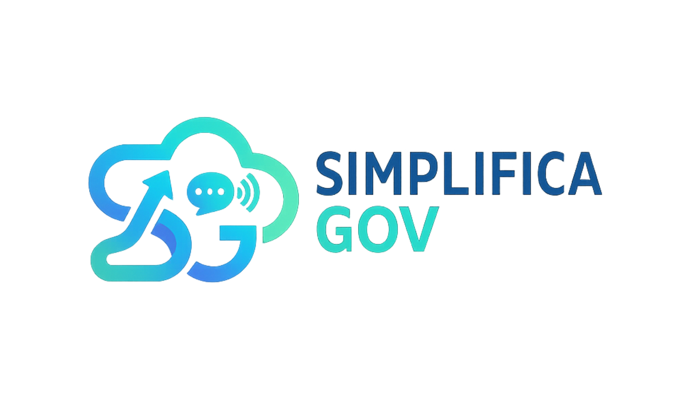

<div align="center">
  
  <h1>SimplificaGov</h1>
  <p>
    <b>Democratizando o acesso à informação governamental através da simplificação com IA.</b>
  </p>
</div>

---

## Índice

- [Visão Geral](#visão-geral)
- [Características](#características)
- [Requisitos](#requisitos)
- [Instalação](#instalação)
- [Configuração](#configuração)
- [Documentação da API](#documentação-da-api)
- [Estrutura do Projeto](#estrutura-do-projeto)
- [Testes](#testes)
- [Segurança](#segurança)
- [Contribuindo](#contribuindo)
- [Membros da Equipe](#membros-da-equipe)
- [Licença](#licença)


## Visão Geral

A API SimplificaGov é uma solução completa para democratizar o acesso à informação legislativa brasileira. O sistema permite que cidadãos acompanhem projetos de lei, recebam alertas personalizados, gerenciem favoritos e obtenham análises simplificadas de conteúdo legislativo complexo.

### Principais Funcionalidades

- **Gestão de Projetos de Lei**: Busca avançada, filtros, ordenação e detalhamento completo
- **Sistema de Autenticação**: JWT com renovação automática de tokens
- **Favoritos**: Marcação e acompanhamento de projetos de interesse
- **Alertas Personalizados**: Notificações sobre tramitações, votações e mudanças
- **Analytics de Parlamentares**: Cálculo de engajamento e áreas de foco
- **Preferências de Temas**: Personalização de conteúdo por interesse
- **Estatísticas**: Dashboards e métricas em tempo real
- **Integração com IA**: Resumos simplificados e toolkits de comunicação


Acesse nossa API: api.simplificagov.com <br>
Acesse o sistema completo: simplificagov.com

## Características

### Versão 2.1.0

- Autenticação JWT completa com refresh tokens
- Sistema de favoritos com atualização automática de relevância
- Alertas personalizados com persistência de leitura
- Analytics de parlamentares com cálculo de engajamento
- Áreas de foco baseadas em análise de palavras-chave
- Busca avançada com múltiplos filtros
- Paginação em todos os endpoints
- Cache de analytics para melhor performance
- Suporte completo a UTF-8

## Requisitos

- PHP 7.4 ou superior
- MySQL 5.7+ ou MariaDB 10.3+
- Extensões PHP: PDO, JSON, cURL, mbstring
- Servidor web (Apache/Nginx) com mod_rewrite habilitado
- (Opcional) OpenAI API Key para funcionalidades de IA

## Instalação

### 1. Clonar o Repositório

```bash
git clone https://github.com/seu-usuario/simplificagov.git
cd simplificagov
```

### 2. Configurar Banco de Dados

Execute o script SQL de criação do banco de dados:

```bash
mysql -u seu_usuario -p nome_do_banco < u744530839_simpificagov.sql
```

Execute o script de atualização para funcionalidades mais recentes:

```bash
mysql -u seu_usuario -p nome_do_banco < database_updates.sql
```

### 3. Configurar Variáveis de Ambiente

Copie o arquivo de exemplo e configure:

```bash
cp config/env.php.example config/env.php
```

Edite `config/env.php` com suas credenciais:

```php
define('DB_HOST', 'localhost');
define('DB_NAME', 'seu_banco');
define('DB_USER', 'seu_usuario');
define('DB_PASS', 'sua_senha');
define('DB_CHARSET', 'utf8mb4');

define('OPENAI_API_KEY', 'sua_chave_openai'); // Opcional
define('JWT_SECRET', 'sua_chave_secreta_jwt');
```

### 4. Configurar Servidor Web

#### Apache

Certifique-se de que o `.htaccess` está habilitado e apontando para `index.php`.

#### Nginx

```nginx
location / {
    try_files $uri $uri/ /index.php?$query_string;
}
```

### 5. Verificar Permissões

```bash
chmod 755 index.php
chmod 644 .htaccess
```

## Configuração

### Chave JWT

Gere uma chave secreta forte para JWT:

```php
// Em helpers/jwt.php
define('JWT_SECRET', bin2hex(random_bytes(32)));
```

### Configuração de CORS

Para desenvolvimento, configure CORS em `index.php` ou via `.htaccess`.

### Configuração de Timezone

Configure o timezone em `index.php`:

```php
date_default_timezone_set('America/Sao_Paulo');
```

## Documentação da API

### Base URL

```
https://api.simplificagov.com
```

### Autenticação

A API utiliza JWT (JSON Web Token) para autenticação. O token deve ser incluído no header de todas as requisições que requerem autenticação:

```
Authorization: Bearer {seu_token}
```

#### Como Funciona a Autenticação

O sistema de autenticação utiliza JWT (JSON Web Token) para garantir segurança e escalabilidade. Abaixo está explicado o fluxo completo:

##### 1. Registro (POST /auth/register)

O processo de registro cria um novo usuário no sistema e retorna um token JWT automaticamente.

**Fluxo:**
1. Cliente envia dados: `nome`, `email`, `senha` (obrigatórios) e campos opcionais
2. Sistema valida formato do email
3. Sistema verifica se o email já está cadastrado (retorna 409 se existir)
4. Sistema cria hash da senha usando `password_hash()` com algoritmo PASSWORD_DEFAULT
5. Sistema salva o usuário no banco de dados
6. Sistema gera token JWT contendo `cidadao_id` e `email`
7. Sistema retorna dados do usuário e token JWT

**Exemplo de Requisição:**
```json
POST /auth/register
{
      "nome": "João Silva",
      "email": "joao@example.com",
  "senha": "senhaSegura123",
      "contato": "joao@example.com",
      "regiao": "Sudeste",
  "preferencia_midia": "texto"
}
```

**Resposta (201):**
```json
{
  "success": true,
  "message": "Cadastro realizado com sucesso",
  "data": {
    "cidadao": {
    "cidadao_id": 1,
    "nome": "João Silva",
    "email": "joao@example.com",
      ...
    },
    "token": "eyJ0eXAiOiJKV1QiLCJh..."
  }
}
```

##### 2. Login (POST /auth/login)

O processo de login autentica um usuário existente e retorna um novo token JWT.

**Fluxo:**
1. Cliente envia `email` e `senha`
2. Sistema busca usuário pelo email no banco de dados
3. Sistema verifica se a senha está correta usando `password_verify()`
4. Sistema verifica se a conta está ativa
5. Se tudo estiver correto, sistema gera novo token JWT
6. Sistema retorna dados do usuário e token JWT

**Exemplo de Requisição:**
```json
POST /auth/login
{
  "email": "joao@example.com",
  "senha": "senhaSegura123"
}
```

**Resposta (200):**
```json
{
  "success": true,
  "message": "Login realizado com sucesso",
  "data": {
    "cidadao": { ... },
    "token": "eyJ0eXAiOiJKV1QiLCJh..."
  }
}
```

**Resposta de Erro (401):**
```json
{
  "success": false,
  "message": "Email ou senha inválidos"
}
```

##### 3. Renovação de Token (POST /auth/refresh)

O processo de refresh permite renovar o token JWT sem precisar fazer login novamente.

**Fluxo:**
1. Cliente envia token atual no header `Authorization: Bearer {token}`
2. Sistema valida o token usando `AuthMiddleware`
3. Sistema extrai `cidadao_id` do token
4. Sistema verifica se o usuário ainda existe e está ativo
5. Sistema gera novo token JWT com os mesmos dados
6. Sistema retorna novo token

**Exemplo de Requisição:**
```
POST /auth/refresh
Authorization: Bearer {token_atual}
```

**Resposta (200):**
```json
{
  "success": true,
  "data": {
    "token": "eyJ0eXAiOiJKV1QiLCJh..."
  }
}
```

**Importante:** O token antigo continua válido até expirar. O refresh gera um novo token sem invalidar o anterior.

##### 4. Obter Dados do Usuário (GET /auth/me)

Retorna os dados do usuário autenticado baseado no token JWT.

**Fluxo:**
1. Cliente envia token no header `Authorization: Bearer {token}`
2. Sistema valida o token usando `AuthMiddleware`
3. Sistema extrai `cidadao_id` do token
4. Sistema busca dados do usuário no banco
5. Sistema remove campos sensíveis (`senha_hash`, `token_refresh`)
6. Sistema retorna dados do usuário

**Exemplo de Requisição:**
```
GET /auth/me
Authorization: Bearer {token}
```

**Resposta (200):**
```json
{
  "success": true,
  "data": {
    "cidadao_id": 1,
    "nome": "João Silva",
    "email": "joao@example.com",
    "contato": "joao@example.com",
    "regiao": "Sudeste",
    "preferencia_midia": "texto",
    ...
  }
}
```

#### Estrutura do Token JWT

O token JWT é composto por três partes separadas por ponto (.):

```
header.payload.signature
```

**Header:**
```json
{
  "typ": "JWT",
  "alg": "HS256"
}
```

**Payload:**
```json
{
      "cidadao_id": 1,
  "email": "joao@example.com",
  "iat": 1700000000,  // Issued at (timestamp)
  "exp": 1700086400   // Expiration (timestamp - 24 horas)
}
```

**Signature:**
Assinatura HMAC SHA256 gerada com a chave secreta configurada em `JWT_SECRET`.

#### Validação do Token

O sistema valida tokens JWT da seguinte forma:

1. **Verifica estrutura:** Token deve ter 3 partes separadas por ponto
2. **Verifica assinatura:** Compara assinatura recebida com assinatura calculada
3. **Verifica expiração:** Verifica se `exp` (expiration) é maior que o timestamp atual
4. **Extrai payload:** Retorna dados do usuário se tudo estiver válido

#### Segurança

**Hash de Senhas:**
- Senhas são armazenadas usando `password_hash()` com algoritmo PASSWORD_DEFAULT
- Verificação é feita com `password_verify()` que é seguro contra timing attacks
- Senhas nunca são retornadas nas respostas da API

**Tokens JWT:**
- Tokens expiram em 24 horas por padrão
- Tokens são assinados com chave secreta (HMAC SHA256)
- Chave secreta deve ser configurada em `config/env.php` como `JWT_SECRET`
- Tokens não são armazenados no banco de dados (stateless)

**Validações:**
- Email é validado com `filter_var()` antes de salvar
- Sistema verifica duplicidade de email antes de criar usuário
- Sistema verifica se conta está ativa antes de autenticar
- Middleware de autenticação valida token em todas as rotas protegidas

#### Fluxo Completo de Autenticação

```
1. Cliente faz POST /auth/register
   └─> Sistema cria usuário e retorna token

2. Cliente armazena token (memória, httpOnly cookie, etc)

3. Cliente faz requisições autenticadas:
   └─> Header: Authorization: Bearer {token}
   └─> Middleware valida token
   └─> Se válido: processa requisição
   └─> Se inválido: retorna 401

4. Quando token está próximo de expirar:
   └─> Cliente faz POST /auth/refresh
   └─> Sistema retorna novo token
   └─> Cliente atualiza token armazenado

5. Se token expirar:
   └─> Cliente precisa fazer login novamente
```

#### Boas Práticas

1. **Armazenamento do Token:**
   - Em produção: Use httpOnly cookies ou memória
   - Evite localStorage (vulnerável a XSS)

2. **Renovação Proativa:**
   - Renove o token quando faltar menos de 1 hora para expirar
   - Implemente retry automático em caso de 401

3. **Tratamento de Erros:**
   - 401: Token inválido ou expirado - faça login novamente
   - 403: Conta desativada - entre em contato com suporte
   - 409: Email já cadastrado - use login ao invés de register

### Endpoints Principais

#### Autenticação

- `POST /auth/register` - Registrar novo usuário
- `POST /auth/login` - Autenticar usuário
- `POST /auth/refresh` - Renovar token
- `GET /auth/me` - Dados do usuário autenticado

#### Projetos de Lei

- `GET /leis` - Listar leis com filtros e paginação
- `GET /leis/{id}` - Detalhes de uma lei
- `POST /leis/{id}/traduzir` - Gerar tradução simplificada

#### Favoritos

- `GET /favoritos` - Listar favoritos do usuário
- `POST /favoritos/{pl_id}` - Adicionar favorito
- `DELETE /favoritos/{pl_id}` - Remover favorito
- `GET /favoritos/verificar/{pl_id}` - Verificar se é favorito

#### Alertas

- `GET /alertas` - Listar alertas do usuário
- `POST /alertas` - Criar alerta
- `GET /alertas/{id}` - Detalhes do alerta
- `PUT /alertas/{id}` - Atualizar alerta
- `DELETE /alertas/{id}` - Remover alerta
- `POST /alertas/{id}/read` - Marcar alerta como lido
- `POST /alertas/{id}/ativar` - Ativar alerta
- `POST /alertas/{id}/desativar` - Desativar alerta

#### Parlamentares

- `GET /parlamentares` - Listar parlamentares
- `GET /parlamentares/{id}` - Detalhes do parlamentar
- `GET /parlamentares/{id}?analytics=1` - Detalhes com analytics
- `GET /parlamentares/{id}/analytics` - Analytics do parlamentar
- `POST /parlamentares` - Criar parlamentar (requer autenticação)
- `PUT /parlamentares/{id}` - Atualizar parlamentar
- `DELETE /parlamentares/{id}` - Remover parlamentar
- `POST /parlamentares/{id}/leis/{pl_id}` - Associar lei ao parlamentar

#### Preferências de Temas

- `GET /preferencias-temas` - Listar preferências
- `POST /preferencias-temas` - Adicionar preferência
- `PUT /preferencias-temas/{tema}` - Atualizar preferência
- `DELETE /preferencias-temas/{tema}` - Remover preferência

#### Estatísticas

- `GET /estatisticas` - Estatísticas gerais
- `GET /estatisticas/leis` - Estatísticas de leis
- `GET /estatisticas/cidadaos` - Estatísticas de cidadãos

### Códigos de Status HTTP

- `200` - Sucesso
- `201` - Criado com sucesso
- `400` - Requisição inválida
- `401` - Não autenticado / Token inválido
- `403` - Acesso negado
- `404` - Recurso não encontrado
- `405` - Método não permitido
- `409` - Conflito (ex: email já cadastrado)
- `422` - Erro de validação
- `500` - Erro interno do servidor

### Formato de Resposta

#### Sucesso

```json
{
"success": true,
"data": { ... },
  "message": "Mensagem opcional"
}
```

#### Erro

```json
{
"success": false,
  "message": "Descrição do erro",
  "error": "Detalhes técnicos"
}
```

#### Paginação

```json
{
  "success": true,
  "data": [...],
  "pagination": {
    "total": 150,
    "limit": 10,
    "offset": 0,
    "has_next": true,
    "has_prev": false
  }
}
```

## Estrutura do Projeto

```
simplificagov/
├── api/
│   └── default.php
├── config/
│   ├── database.php      # Conexão com banco de dados
│   └── env.php           # Variáveis de ambiente
├── controllers/          # Camada de controle
│   ├── AlertaController.php
│   ├── AuthController.php
│   ├── CidadaoController.php
│   ├── EstatisticaController.php
│   ├── FavoritoController.php
│   ├── LeiController.php
│   ├── ParlamentarController.php
│   └── PreferenciaTemaController.php
├── core/
│   └── Router.php        # Roteador da aplicação
├── helpers/              # Funções auxiliares
│   ├── http.php          # Helpers HTTP
│   ├── jwt.php           # Autenticação JWT
│   ├── response.php      # Formatação de respostas
│   └── validator.php     # Validação de dados
├── middleware/
│   └── AuthMiddleware.php # Middleware de autenticação
├── models/               # Camada de dados
│   ├── AlertaModel.php
│   ├── CidadaoModel.php
│   ├── FavoritoModel.php
│   ├── ParlamentarModel.php
│   ├── PLModel.php
│   └── PreferenciaTemaModel.php
├── routes/               # Definição de rotas
│   ├── alertas.php
│   ├── auth.php
│   ├── cidadao.php
│   ├── estatisticas.php
│   ├── favoritos.php
│   ├── leis.php
│   ├── parlamentares.php
│   └── preferencias-temas.php
├── services/             # Integrações externas
│   ├── CamaraService.php
│   ├── IAService.php
│   └── SenadoService.php
├── database_updates.sql  # Script de atualização do banco
├── error_handler.php     # Tratamento de erros
├── index.php             # Ponto de entrada
├── test_sistema_completo.php # Testes automatizados
├── .htaccess             # Configuração Apache
└── README.md
```

## Testes

### Teste Automatizado

Execute o arquivo de testes completo:

```bash
php test_sistema_completo.php
```

Ou acesse via navegador:

```
https://api.simplificagov.com/test_sistema_completo.php
```

### Teste Manual com cURL

```bash
# Registrar usuário
curl -X POST http://localhost/simplificagov/api/auth/register \
  -H "Content-Type: application/json" \
  -d '{"nome":"Teste","email":"teste@example.com","senha":"senha123"}'

# Login
curl -X POST http://localhost/simplificagov/api/auth/login \
  -H "Content-Type: application/json" \
  -d '{"email":"teste@example.com","senha":"senha123"}'

# Listar leis
curl -X GET http://localhost/simplificagov/api/leis \
  -H "Authorization: Bearer SEU_TOKEN"
```

## Segurança

### Boas Práticas Implementadas

- Autenticação JWT com expiração de tokens
- Hash de senhas com `password_hash()`
- Validação de entrada em todos os endpoints
- Prepared statements para prevenir SQL injection
- Sanitização de dados de saída
- Headers de segurança configurados

### Recomendações

1. **Sempre use HTTPS em produção**
2. **Proteja tokens JWT** - Não armazene em localStorage em produção
3. **Valide dados no cliente** antes de enviar
4. **Implemente rate limiting** para prevenir abuso
5. **Mantenha dependências atualizadas**
6. **Use chaves secretas fortes** para JWT

## Funcionalidades Avançadas

### Tradução e Simplificação com IA

O sistema utiliza Inteligência Artificial para traduzir e simplificar textos jurídicos complexos, tornando-os acessíveis para cidadãos comuns.

#### Agente de Tradução

O agente responsável pela tradução é o **IAService**, localizado em `services/IAService.php`. Este serviço oferece duas funcionalidades principais:

1. **Resumo Simples** (`gerarResumoSimples`): Traduz textos jurídicos para linguagem simples
2. **Toolkit Completo** (`gerarToolkitCompleto`): Gera material completo de comunicação

#### O que é o Toolkit Completo?

O Toolkit Completo é um conjunto de materiais de comunicação gerados automaticamente pela IA para facilitar a divulgação e compreensão de projetos de lei. Ele transforma textos jurídicos complexos em conteúdo acessível e pronto para uso em diferentes formatos de comunicação.

**Objetivo:** Criar um "kit de ferramentas" que permite que qualquer pessoa, mesmo sem conhecimento jurídico, possa entender, explicar e compartilhar um projeto de lei de forma clara e engajadora.

**Componentes do Toolkit:**

1. **Título Impactante** (`titulo`)
   - Título claro e chamativo (máximo 60 caracteres)
   - Substitui o título jurídico formal por algo mais acessível
   - Exemplo: "Lei que reduz impostos sobre remédios" ao invés de "PL 1234/2023 - Altera art. 5º da Lei 8.080/90"

2. **Resumo Curto** (`resumo_curto`)
   - Resumo em 2-3 frases
   - Explica de forma simples o que o projeto faz
   - Ideal para compartilhamento rápido em redes sociais

3. **Card de Divulgação** (`card`)
   - **CTA (Call to Action)**: Frase de chamada para ação (máximo 30 caracteres)
     - Exemplo: "Apoie esta mudança!", "Compartilhe agora!"
   - **Bullets**: Lista de 3 pontos principais do projeto
     - Destaque dos benefícios ou mudanças mais importantes
     - Formato ideal para posts, cards visuais, infográficos

4. **Roteiro de Vídeo** (`roteiro_video`)
   - **Gancho**: Pergunta ou frase de impacto para começar o vídeo (máximo 80 caracteres)
     - Exemplo: "Você sabia que pode economizar na conta de luz?"
   - **Explicação**: Texto em 2-3 parágrafos explicando o projeto de forma simples
     - Linguagem acessível, sem termos jurídicos
     - Pode ser usado como narração ou legenda
   - **Chamada para Ação**: Frase final incentivando engajamento (máximo 50 caracteres)
     - Exemplo: "Compartilhe e apoie no portal!"

**Estrutura JSON Gerada:**

```json
{
  "titulo": "Lei que simplifica acesso à saúde pública",
  "resumo_curto": "Este projeto facilita o agendamento de consultas pelo SUS, reduzindo filas e espera. Permite que cidadãos marquem consultas online e recebam confirmação por WhatsApp.",
  "card": {
    "cta": "Apoie esta mudança!",
    "bullets": [
      "Agendamento online pelo celular",
      "Confirmação automática por WhatsApp",
      "Redução de filas e espera"
    ]
  },
  "roteiro_video": {
    "gancho": "Você já ficou horas na fila do SUS?",
    "explicacao": "Este projeto de lei propõe uma mudança importante no sistema de saúde pública. Agora você poderá agendar suas consultas diretamente pelo celular, sem precisar ir até o posto de saúde. O sistema enviará confirmação automática por WhatsApp, garantindo que você não perca sua consulta. Isso vai reduzir muito as filas e o tempo de espera para todos.",
    "chamada_acao": "Compartilhe e apoie no portal!"
  }
}
```

**Casos de Uso:**

- **Redes Sociais**: Usar o título, resumo curto e card para posts
- **Vídeos Explicativos**: Usar o roteiro completo para criar conteúdo em vídeo
- **Infográficos**: Usar os bullets do card para criar visualizações
- **Materiais de Campanha**: Usar o CTA e chamada para ação em materiais de divulgação
- **Comunicação Institucional**: Usar o resumo curto em comunicados oficiais simplificados

**Vantagens:**

- **Automação**: Gera conteúdo profissional sem necessidade de redator
- **Consistência**: Mantém tom e estilo adequados para comunicação pública
- **Acessibilidade**: Traduz linguagem jurídica para linguagem comum
- **Engajamento**: Cria materiais otimizados para compartilhamento e viralização
- **Multi-formato**: Um único toolkit serve para múltiplos canais de comunicação

#### Modelo de LLM Utilizado

O sistema utiliza o modelo **GPT-3.5-turbo** da OpenAI através da API oficial.

**Configurações do Modelo:**
- **Modelo:** `gpt-3.5-turbo`
- **API Base:** `https://api.openai.com/v1` (configurável via `OPENAI_API_BASE`)
- **Timeout:** 30 segundos (resumo) / 45 segundos (toolkit)

#### Prompts Utilizados

##### 1. Prompt para Resumo Simples

**System Message:**
```
Você é um tradutor especializado em simplificar textos jurídicos para cidadãos comuns, mantendo a precisão legal.
```

**User Prompt:**
```
Traduza o seguinte texto jurídico para linguagem simples e acessível para cidadãos comuns. 
Mantenha o significado legal, mas use palavras do dia a dia. 
Seja claro e objetivo. Limite a resposta a no máximo 300 palavras.

Texto jurídico:
{texto_original}
```

**Parâmetros:**
- Temperature: `0.7` (balance entre criatividade e precisão)
- Max Tokens: `500`

##### 2. Prompt para Toolkit Completo

**System Message:**
```
Você é um especialista em comunicação pública e engajamento cívico. Gere sempre JSON válido.
```

**User Prompt:**
```
Com base no seguinte texto de projeto de lei, gere um toolkit completo de comunicação:

Título original: {titulo_original}

Texto: {texto_original}

Gere um JSON com a seguinte estrutura:
{
  "titulo": "Título impactante e claro (máx 60 caracteres)",
  "resumo_curto": "Resumo em 2-3 frases",
  "card": {
    "cta": "Chamada para ação (máx 30 caracteres)",
    "bullets": ["Ponto principal 1", "Ponto principal 2", "Ponto principal 3"]
  },
  "roteiro_video": {
    "gancho": "Pergunta ou frase de impacto para começar (máx 80 caracteres)",
    "explicacao": "Explicação simples em 2-3 parágrafos",
    "chamada_acao": "Chamada final para ação (máx 50 caracteres)"
  }
}

Retorne APENAS o JSON, sem markdown, sem explicações adicionais.
```

**Parâmetros:**
- Temperature: `0.8` (mais criativo para comunicação)
- Max Tokens: `1000`

#### Fluxo de Tradução

1. **Cliente solicita tradução:** `POST /leis/{id}/traduzir`
2. **Sistema busca PL:** Verifica se existe e tem `texto_original`
3. **Geração de Resumo:** Chama `IAService::gerarResumoSimples()`
4. **Geração de Toolkit:** Chama `IAService::gerarToolkitCompleto()`
5. **Persistência:** Salva no banco na tabela `traducao_simples`
6. **Resposta:** Retorna resumo e toolkit para o cliente

#### Tratamento de Erros

O sistema possui fallbacks robustos:

- **Sem API Key:** Retorna stub com texto truncado
- **Erro na API:** Retorna toolkit padrão com estrutura básica
- **Erro de Parsing:** Retorna estrutura mínima válida
- **Timeout:** Loga erro e retorna fallback

#### Estrutura do Toolkit Gerado

```json
{
  "titulo": "Título impactante",
  "resumo_curto": "Resumo em 2-3 frases",
  "card": {
    "cta": "Chamada para ação",
    "bullets": ["Ponto 1", "Ponto 2", "Ponto 3"]
  },
  "roteiro_video": {
    "gancho": "Pergunta de impacto",
    "explicacao": "Explicação detalhada",
    "chamada_acao": "Chamada final"
  }
}
```

#### Configuração

Para habilitar a funcionalidade de IA, configure no `config/env.php`:

```php
define('OPENAI_API_KEY', 'sua_chave_openai');
define('OPENAI_API_BASE', 'https://api.openai.com/v1'); // Opcional
```

**Nota:** Sem a chave da API, o sistema funciona em modo stub, retornando respostas básicas sem processamento de IA.

### Analytics de Parlamentares

O sistema calcula automaticamente métricas de engajamento baseadas em:

- Número de projetos apresentados
- Total de visualizações recebidas
- Total de favoritos recebidos
- Análise de palavras-chave dos textos

Fórmula de engajamento:
```
engajamento_score = (projetos × 10) + (visualizações × 0.1) + (favoritos × 5)
```

### Áreas de Foco

O sistema extrai automaticamente áreas de foco dos parlamentares analisando:

- Textos dos projetos de lei
- Ementas e descrições
- Palavras-chave mais frequentes
- Filtragem de stopwords em português

### Persistência de Leitura de Alertas

Os alertas podem ser marcados como lidos, com timestamp de quando foram lidos. Isso permite:

- Filtrar alertas não lidos
- Estatísticas de engajamento
- Melhor experiência do usuário

## Contribuindo

Contribuições são bem-vindas! Por favor:

1. Faça um fork do projeto
2. Crie uma branch para sua feature (`git checkout -b feature/AmazingFeature`)
3. Commit suas mudanças (`git commit -m 'Add some AmazingFeature'`)
4. Push para a branch (`git push origin feature/AmazingFeature`)
5. Abra um Pull Request

### Padrões de Código

- Siga PSR-12 para estilo de código PHP
- Adicione comentários em português
- Escreva testes para novas funcionalidades
- Atualize a documentação quando necessário

## Membros da Equipe

| Nome | Função | GitHub |
|------|--------|--------|
| **Maysa Santos** | Tech Lead & Fullstack Dev | [@Maysamkt](https://github.com/Maysamkt) |
| **Rafaela Rocha Feijó** | Product Manager | [@Rafaelafeijo](https://github.com/Rafaelafeijo) |
| **Maikon Icaro dos Santos** | AI Engineer | [@Maikon-sant](https://github.com/Maikon-sant) |
| **Jessica Lopes** | Frontend Developer | [@iamdivaloper](https://github.com/iamdivaloper) |

## Licença

Este projeto está sob a licença MIT. Para mais detalhes, consulte o arquivo [LICENSE](LICENSE).

## Suporte

Para suporte, abra uma issue no GitHub ou entre em contato através do email: maikonicaro04@gmail.com

## Changelog

### Versão 1.0.0

- Funcionalidades básicas de leis e cidadãos
- Integração com APIs da Câmara e Senado
- Autenticação JWT completa
- Sistema de favoritos
- Sistema de alertas
- Preferências de temas
- Busca avançada de leis
- Estatísticas em tempo real
- Paginação em todos os endpoints
- Suporte a caracteres UTF-8
- Adicionado campo `focus` (JSON) em parlamentares
- Implementado sistema de leitura de alertas
- Adicionado cálculo de analytics de parlamentares
- Implementado extração automática de áreas de foco
- Melhorado sistema de cache de analytics
- Adicionado endpoint dedicado para analytics


---

**Versão da API:** 1.0.0  
**Última atualização:** 2025-11-23  
**Base URL:** `https://api.simplificagov.com/`

